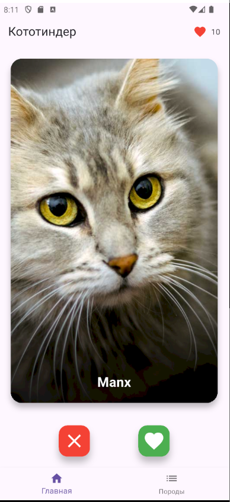
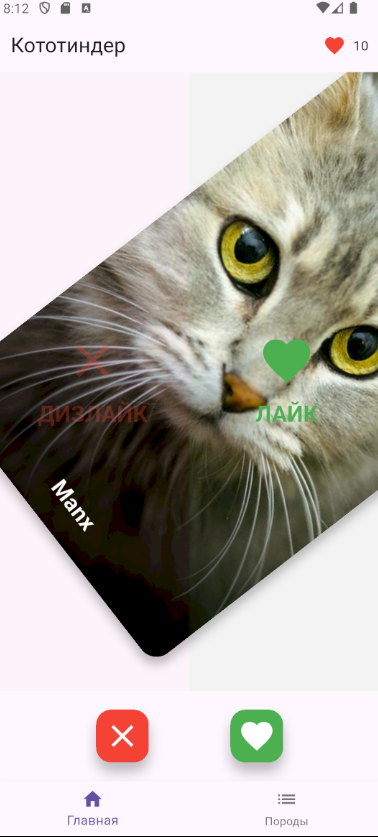
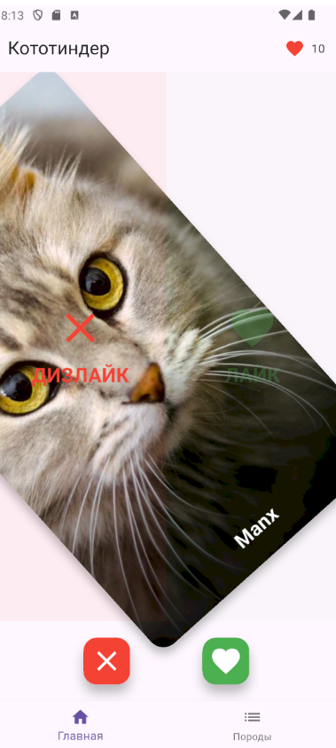
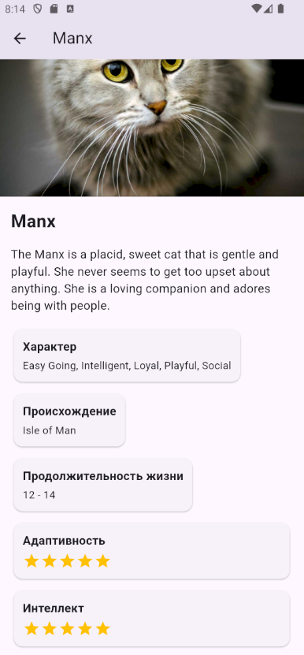
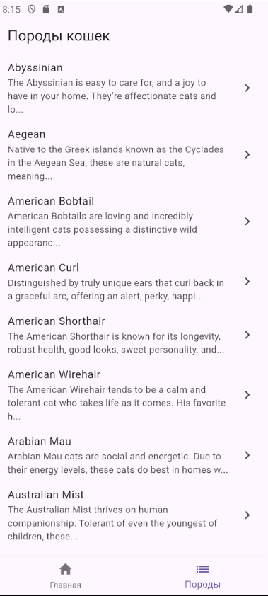

# Кототиндер


Tinder-подобное приложение для знакомства с породами кошек. Проводите вправо, чтобы лайкнуть котика, влево — чтобы пропустить. Узнавайте интересные факты о разных породах!


## Реализованные фичи

- **Главный экран со случайными котиками** — каждый раз новая порода
- **Свайп-интерфейс** как в Tinder:
  - Свайп вправо/влево или кнопки для лайка/дизлайка
  - Визуальные индикаторы направления
  - Анимации при свайпе
- **Счетчик лайков** — отслеживайте понравившихся котиков
- **Детальная информация о породах**:
  - Полное описание породы
  - Характер, происхождение, продолжительность жизни
  - Рейтинги адаптивности и интеллекта (звезды 1-5)
- **Список всех пород** с краткой информацией
- **Навигация** через BottomNavigationBar


## Интерфейс приложения

### Главный экран


*Свайпайте котиков вправо/влево или используйте кнопки*

### Свайп вправо - лайк


*Часть экрана зеленеет, появляетяся надпись действия*

### Свайп влево - дизлайк


*Часть экрана краснеет, появляетяся надпись действия*

### Детальная информация


*Вся информация о породе в структурированном виде*

### Список пород


*Полный каталог пород*

## Установка и запуск

### Предварительные требования
- Flutter SDK (версия 3.0.0 или выше)
- Android Studio / VS Code
- Эмулятор Android или физическое устройство

### Шаги установки
```bash
# 1. Клонируйте репозиторий
git clone https://github.com/GlebEdu/CatTinder-Flutter-HW1.git

# 2. Перейдите в папку проекта

# 3. Установите зависимости
flutter pub get

# 4. Запустите приложение
flutter run
```

### Для разработчиков
Приложение использует TheCatAPI. В учебных целях API-ключ оставлен в открытом доступе:

```dart
// lib/constants/api_constants.dart
static const String apiKey = 'live_czeFCZ96bAVUO8pW99fQhfvo5minkWwiRvx4HOsdaOIknUGY3JMgaavMfi4cavD1';
```

Для production использования получите свой ключ на [thecatapi.com](https://thecatapi.com/signup).

## Технологии

- **Flutter** 3.0+ — кросс-платформенная разработка
- **Dart** — язык программирования
- **http** — работа с API
- **cached_network_image** — кэширование изображений
- **equatable** — сравнение объектов

## Скачать APK

[Скачать APK](https://disk.360.yandex.ru/d/19krw5931hQ-uA)
